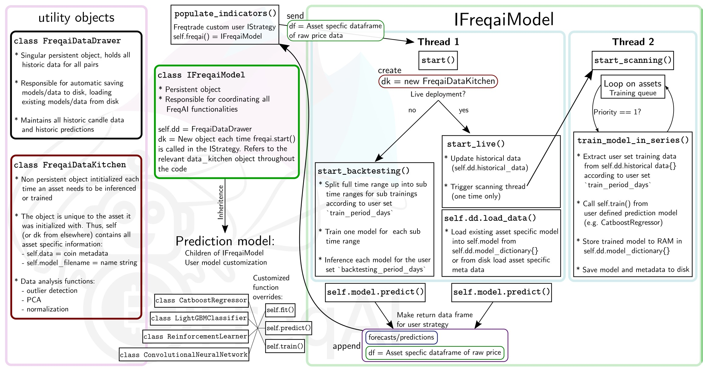

# Development 

The class structure and details algorithmic overview is depicted in the following diagram: 

As shown, there are three distinct objects comprising `FreqAI`:

* IFreqaiModel
  * Singular persistent object containing all the necessary logic to collect data, store data, process data, engineer features, run training, and inference models. 
* FreqaiDataKitchen
  * A non-persistent object which is created uniquely for each unique asset/model. Beyond metadata, it also contains a variety of data processing tools. 
* FreqaiDataDrawer
  * Singular persistent object containing all the historical predictions, models, and save/load methods. 

There are a variety of built-in prediction models which inherit directly from `IFreqaiModel` including:

* CatboostRegressor
* CatboostRegressorMultiTarget
* CatboostClassifier
* LightGBMRegressor
* LightGBMRegressorMultiTarget
* LightGBMClassifier
* XGBoostRegressor
* XGBoostRegressorMultiTarget
* XGBoostClassifier

Each of these have full access to all methods in `IFreqaiModel`. And can therefore, override any of those functions at will. However, advanced users will likely stick to overriding `fit()`, `train()`, `predict()`, and `data_cleaning_train/predict()`. 