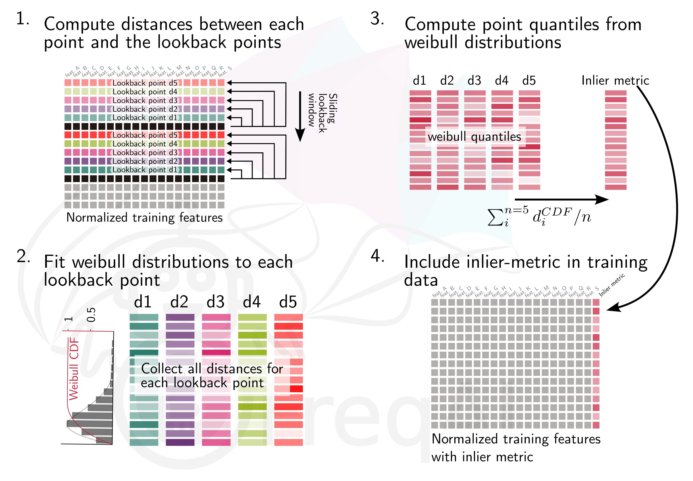
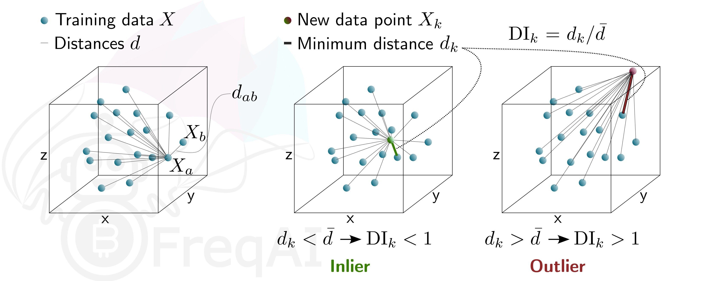
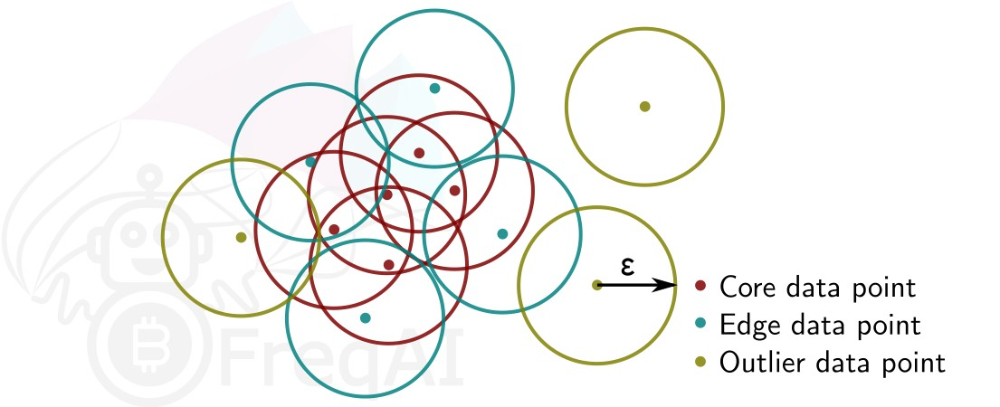

# Feature engineering

## Defining the features

Low level feature engineering is performed in the user strategy within a set of functions called `feature_engineering_*`. These function set the `base features` such as, `RSI`, `MFI`, `EMA`, `SMA`, time of day, volume, etc. The `base features` can be custom indicators or they can be imported from any technical-analysis library that you can find. FreqAI is equipped with a set of functions to simplify rapid large-scale feature engineering:

|  Function | Description |
|---------------|-------------|
| `feature_engineering_expand_all()` | This optional function will automatically expand the defined features on the config defined `indicator_periods_candles`, `include_timeframes`, `include_shifted_candles`, and `include_corr_pairs`.
| `feature_engineering_expand_basic()` | This optional function will automatically expand the defined features on the config defined `include_timeframes`, `include_shifted_candles`, and `include_corr_pairs`. Note: this function does *not* expand across `include_periods_candles`.
| `feature_engineering_standard()` | This optional function will be called once with the dataframe of the base timeframe. This is the final function to be called, which means that the dataframe entering this function will contain all the features and columns from the base asset created by the other `feature_engineering_expand` functions. This function is a good place to do custom exotic feature extractions (e.g. tsfresh). This function is also a good place for any feature that should not be auto-expanded upon (e.g., day of the week).
| `set_freqai_targets()` | Required function to set the targets for the model. All targets must be prepended with `&` to be recognized by the FreqAI internals.

Meanwhile, high level feature engineering is handled within `"feature_parameters":{}` in the FreqAI config. Within this file, it is possible to decide large scale feature expansions on top of the `base_features` such as "including correlated pairs" or "including informative timeframes" or even "including recent candles."

It is advisable to start from the template `feature_engineering_*` functions in the source provided example strategy (found in `templates/FreqaiExampleStrategy.py`) to ensure that the feature definitions are following the correct conventions. Here is an example of how to set the indicators and labels in the strategy:

```python
    def feature_engineering_expand_all(self, dataframe: DataFrame, period, metadata, **kwargs) -> DataFrame:
        """
        *Only functional with FreqAI enabled strategies*
        This function will automatically expand the defined features on the config defined
        `indicator_periods_candles`, `include_timeframes`, `include_shifted_candles`, and
        `include_corr_pairs`. In other words, a single feature defined in this function
        will automatically expand to a total of
        `indicator_periods_candles` * `include_timeframes` * `include_shifted_candles` *
        `include_corr_pairs` numbers of features added to the model.

        All features must be prepended with `%` to be recognized by FreqAI internals.

        Access metadata such as the current pair/timeframe/period with:

        `metadata["pair"]` `metadata["tf"]`  `metadata["period"]`

        :param df: strategy dataframe which will receive the features
        :param period: period of the indicator - usage example:
        :param metadata: metadata of current pair
        dataframe["%-ema-period"] = ta.EMA(dataframe, timeperiod=period)
        """

        dataframe["%-rsi-period"] = ta.RSI(dataframe, timeperiod=period)
        dataframe["%-mfi-period"] = ta.MFI(dataframe, timeperiod=period)
        dataframe["%-adx-period"] = ta.ADX(dataframe, timeperiod=period)
        dataframe["%-sma-period"] = ta.SMA(dataframe, timeperiod=period)
        dataframe["%-ema-period"] = ta.EMA(dataframe, timeperiod=period)

        bollinger = qtpylib.bollinger_bands(
            qtpylib.typical_price(dataframe), window=period, stds=2.2
        )
        dataframe["bb_lowerband-period"] = bollinger["lower"]
        dataframe["bb_middleband-period"] = bollinger["mid"]
        dataframe["bb_upperband-period"] = bollinger["upper"]

        dataframe["%-bb_width-period"] = (
            dataframe["bb_upperband-period"]
            - dataframe["bb_lowerband-period"]
        ) / dataframe["bb_middleband-period"]
        dataframe["%-close-bb_lower-period"] = (
            dataframe["close"] / dataframe["bb_lowerband-period"]
        )

        dataframe["%-roc-period"] = ta.ROC(dataframe, timeperiod=period)

        dataframe["%-relative_volume-period"] = (
            dataframe["volume"] / dataframe["volume"].rolling(period).mean()
        )

        return dataframe

    def feature_engineering_expand_basic(self, dataframe: DataFrame, metadata, **kwargs) -> DataFrame:
        """
        *Only functional with FreqAI enabled strategies*
        This function will automatically expand the defined features on the config defined
        `include_timeframes`, `include_shifted_candles`, and `include_corr_pairs`.
        In other words, a single feature defined in this function
        will automatically expand to a total of
        `include_timeframes` * `include_shifted_candles` * `include_corr_pairs`
        numbers of features added to the model.

        Features defined here will *not* be automatically duplicated on user defined
        `indicator_periods_candles`

        Access metadata such as the current pair/timeframe with:

        `metadata["pair"]` `metadata["tf"]`

        All features must be prepended with `%` to be recognized by FreqAI internals.

        :param df: strategy dataframe which will receive the features
        :param metadata: metadata of current pair
        dataframe["%-pct-change"] = dataframe["close"].pct_change()
        dataframe["%-ema-200"] = ta.EMA(dataframe, timeperiod=200)
        """
        dataframe["%-pct-change"] = dataframe["close"].pct_change()
        dataframe["%-raw_volume"] = dataframe["volume"]
        dataframe["%-raw_price"] = dataframe["close"]
        return dataframe

    def feature_engineering_standard(self, dataframe: DataFrame, metadata, **kwargs) -> DataFrame:
        """
        *Only functional with FreqAI enabled strategies*
        This optional function will be called once with the dataframe of the base timeframe.
        This is the final function to be called, which means that the dataframe entering this
        function will contain all the features and columns created by all other
        freqai_feature_engineering_* functions.

        This function is a good place to do custom exotic feature extractions (e.g. tsfresh).
        This function is a good place for any feature that should not be auto-expanded upon
        (e.g. day of the week).

        Access metadata such as the current pair with:

        `metadata["pair"]`

        All features must be prepended with `%` to be recognized by FreqAI internals.

        :param df: strategy dataframe which will receive the features
        :param metadata: metadata of current pair
        usage example: dataframe["%-day_of_week"] = (dataframe["date"].dt.dayofweek + 1) / 7
        """
        dataframe["%-day_of_week"] = (dataframe["date"].dt.dayofweek + 1) / 7
        dataframe["%-hour_of_day"] = (dataframe["date"].dt.hour + 1) / 25
        return dataframe

    def set_freqai_targets(self, dataframe: DataFrame, metadata, **kwargs) -> DataFrame:
        """
        *Only functional with FreqAI enabled strategies*
        Required function to set the targets for the model.
        All targets must be prepended with `&` to be recognized by the FreqAI internals.

        Access metadata such as the current pair with:

        `metadata["pair"]`

        :param df: strategy dataframe which will receive the targets
        :param metadata: metadata of current pair
        usage example: dataframe["&-target"] = dataframe["close"].shift(-1) / dataframe["close"]
        """
        dataframe["&-s_close"] = (
            dataframe["close"]
            .shift(-self.freqai_info["feature_parameters"]["label_period_candles"])
            .rolling(self.freqai_info["feature_parameters"]["label_period_candles"])
            .mean()
            / dataframe["close"]
            - 1
            )
        
        return dataframe
```

In the presented example, the user does not wish to pass the `bb_lowerband` as a feature to the model,
and has therefore not prepended it with `%`. The user does, however, wish to pass `bb_width` to the
model for training/prediction and has therefore prepended it with `%`.

After having defined the `base features`, the next step is to expand upon them using the powerful `feature_parameters` in the configuration file:

```json
    "freqai": {
        //...
        "feature_parameters" : {
            "include_timeframes": ["5m","15m","4h"],
            "include_corr_pairlist": [
                "ETH/USD",
                "LINK/USD",
                "BNB/USD"
            ],
            "label_period_candles": 24,
            "include_shifted_candles": 2,
            "indicator_periods_candles": [10, 20]
        },
        //...
    }
```

The `include_timeframes` in the config above are the timeframes (`tf`) of each call to `feature_engineering_expand_*()` in the strategy. In the presented case, the user is asking for the `5m`, `15m`, and `4h` timeframes of the `rsi`, `mfi`, `roc`, and `bb_width` to be included in the feature set.

You can ask for each of the defined features to be included also for informative pairs using the `include_corr_pairlist`. This means that the feature set will include all the features from `feature_engineering_expand_*()` on all the `include_timeframes` for each of the correlated pairs defined in the config (`ETH/USD`, `LINK/USD`, and `BNB/USD` in the presented example).

`include_shifted_candles` indicates the number of previous candles to include in the feature set. For example, `include_shifted_candles: 2` tells FreqAI to include the past 2 candles for each of the features in the feature set.

In total, the number of features the user of the presented example strat has created is: length of `include_timeframes` * no. features in `feature_engineering_expand_*()` * length of `include_corr_pairlist` * no. `include_shifted_candles` * length of `indicator_periods_candles`
 $= 3 * 3 * 3 * 2 * 2 = 108$.


### Gain finer control over `feature_engineering_*` functions with `metadata`

 All `feature_engineering_*` and `set_freqai_targets()` functions are passed a `metadata` dictionary which contains information about the `pair`, `tf` (timeframe), and `period` that FreqAI is automating for feature building. As such, a user can use `metadata` inside `feature_engineering_*` functions as criteria for blocking/reserving features for certain timeframes, periods, pairs etc.

 ```python
def feature_engineering_expand_all(self, dataframe, period, metadata, **kwargs):
 if metadata["tf"] == "1h":
    dataframe["%-roc-period"] = ta.ROC(dataframe, timeperiod=period)
```

This will block `ta.ROC()` from being added to any timeframes other than `"1h"`.

### Returning additional info from training

Important metrics can be returned to the strategy at the end of each model training by assigning them to `dk.data['extra_returns_per_train']['my_new_value'] = XYZ` inside the custom prediction model class. 

FreqAI takes the `my_new_value` assigned in this dictionary and expands it to fit the dataframe that is returned to the strategy. You can then use the returned metrics in your strategy through `dataframe['my_new_value']`. An example of how return values can be used in FreqAI are the `&*_mean` and `&*_std` values that are used to [created a dynamic target threshold](freqai-configuration.md#creating-a-dynamic-target-threshold).

Another example, where the user wants to use live metrics from the trade database, is shown below:

```json
    "freqai": {
        "extra_returns_per_train": {"total_profit": 4}
    }
```

You need to set the standard dictionary in the config so that FreqAI can return proper dataframe shapes. These values will likely be overridden by the prediction model, but in the case where the model has yet to set them, or needs a default initial value, the pre-set values are what will be returned.

## Feature normalization

FreqAI is strict when it comes to data normalization. The train features, $X^{train}$, are always normalized to [-1, 1] using a shifted min-max normalization:

$$X^{train}_{norm} = 2 * \frac{X^{train} - X^{train}.min()}{X^{train}.max() - X^{train}.min()} - 1$$

All other data (test data and unseen prediction data in dry/live/backtest) is always automatically normalized to the training feature space according to industry standards. FreqAI stores all the metadata required to ensure that test and prediction features will be properly normalized and that predictions are properly denormalized. For this reason, it is not recommended to eschew industry standards and modify FreqAI internals - however - advanced users can do so by inheriting `train()` in their custom `IFreqaiModel` and using their own normalization functions.

## Data dimensionality reduction with Principal Component Analysis

You can reduce the dimensionality of your features by activating the `principal_component_analysis` in the config:

```json
    "freqai": {
        "feature_parameters" : {
            "principal_component_analysis": true
        }
    }
```

This will perform PCA on the features and reduce their dimensionality so that the explained variance of the data set is >= 0.999. Reducing data dimensionality makes training the model faster and hence allows for more up-to-date models. 

## Inlier metric

The `inlier_metric` is a metric aimed at quantifying how similar the features of a data point are to the most recent historical data points. 

You define the lookback window by setting `inlier_metric_window` and FreqAI computes the distance between the present time point and each of the previous `inlier_metric_window` lookback points. A Weibull function is fit to each of the lookback distributions and its cumulative distribution function (CDF) is used to produce a quantile for each lookback point. The `inlier_metric` is then computed for each time point as the average of the corresponding lookback quantiles. The figure below explains the concept for an `inlier_metric_window` of 5.



FreqAI adds the `inlier_metric` to the training features and hence gives the model access to a novel type of temporal information. 

This function does **not** remove outliers from the data set.

## Weighting features for temporal importance

FreqAI allows you to set a `weight_factor` to weight recent data more strongly than past data via an exponential function:

$$ W_i = \exp(\frac{-i}{\alpha*n}) $$

where $W_i$ is the weight of data point $i$ in a total set of $n$ data points. Below is a figure showing the effect of different weight factors on the data points in a feature set.


## Outlier detection

Equity and crypto markets suffer from a high level of non-patterned noise in the form of outlier data points. FreqAI implements a variety of methods to identify such outliers and hence mitigate risk.

### Identifying outliers with the Dissimilarity Index (DI)

 The Dissimilarity Index (DI) aims to quantify the uncertainty associated with each prediction made by the model. 

You can tell FreqAI to remove outlier data points from the training/test data sets using the DI by including the following statement in the config:

```json
    "freqai": {
        "feature_parameters" : {
            "DI_threshold": 1
        }
    }
```

 The DI allows predictions which are outliers (not existent in the model feature space) to be thrown out due to low levels of certainty. To do so, FreqAI measures the distance between each training data point (feature vector), $X_{a}$, and all other training data points:

$$ d_{ab} = \sqrt{\sum_{j=1}^p(X_{a,j}-X_{b,j})^2} $$

where $d_{ab}$ is the distance between the normalized points $a$ and $b$, and $p$ is the number of features, i.e., the length of the vector $X$. The characteristic distance, $\overline{d}$, for a set of training data points is simply the mean of the average distances:

$$ \overline{d} = \sum_{a=1}^n(\sum_{b=1}^n(d_{ab}/n)/n) $$

$\overline{d}$ quantifies the spread of the training data, which is compared to the distance between a new prediction feature vectors, $X_k$ and all the training data:

$$ d_k = \arg \min d_{k,i} $$

This enables the estimation of the Dissimilarity Index as:

$$ DI_k = d_k/\overline{d} $$

You can tweak the DI through the `DI_threshold` to increase or decrease the extrapolation of the trained model. A higher `DI_threshold` means that the DI is more lenient and allows predictions further away from the training data to be used whilst a lower `DI_threshold` has the opposite effect and hence discards more predictions.

Below is a figure that describes the DI for a 3D data set.



### Identifying outliers using a Support Vector Machine (SVM)

You can tell FreqAI to remove outlier data points from the training/test data sets using a Support Vector Machine (SVM) by including the following statement in the config:

```json
    "freqai": {
        "feature_parameters" : {
            "use_SVM_to_remove_outliers": true
        }
    }
```

The SVM will be trained on the training data and any data point that the SVM deems to be beyond the feature space will be removed.

FreqAI uses `sklearn.linear_model.SGDOneClassSVM` (details are available on scikit-learn's webpage [here](https://scikit-learn.org/stable/modules/generated/sklearn.linear_model.SGDOneClassSVM.html) (external website)) and you can elect to provide additional parameters for the SVM, such as `shuffle`, and `nu`.

The parameter `shuffle` is by default set to `False` to ensure consistent results. If it is set to `True`, running the SVM multiple times on the same data set might result in different outcomes due to `max_iter` being to low for the algorithm to reach the demanded `tol`. Increasing `max_iter` solves this issue but causes the procedure to take longer time.

The parameter `nu`, *very* broadly, is the amount of data points that should be considered outliers and should be between 0 and 1.

### Identifying outliers with DBSCAN

You can configure FreqAI to use DBSCAN to cluster and remove outliers from the training/test data set or incoming outliers from predictions, by activating `use_DBSCAN_to_remove_outliers` in the config:

```json
    "freqai": {
        "feature_parameters" : {
            "use_DBSCAN_to_remove_outliers": true
        }
    }
```

DBSCAN is an unsupervised machine learning algorithm that clusters data without needing to know how many clusters there should be.

Given a number of data points $N$, and a distance $\varepsilon$, DBSCAN clusters the data set by setting all data points that have $N-1$ other data points within a distance of $\varepsilon$ as *core points*. A data point that is within a distance of $\varepsilon$ from a *core point* but that does not have $N-1$ other data points within a distance of $\varepsilon$ from itself is considered an *edge point*. A cluster is then the collection of *core points* and *edge points*. Data points that have no other data points at a distance $<\varepsilon$ are considered outliers. The figure below shows a cluster with $N = 3$.



FreqAI uses `sklearn.cluster.DBSCAN` (details are available on scikit-learn's webpage [here](https://scikit-learn.org/stable/modules/generated/sklearn.cluster.DBSCAN.html) (external website)) with `min_samples` ($N$) taken as 1/4 of the no. of time points (candles) in the feature set. `eps` ($\varepsilon$) is computed automatically as the elbow point in the *k-distance graph* computed from the nearest neighbors in the pairwise distances of all data points in the feature set.
